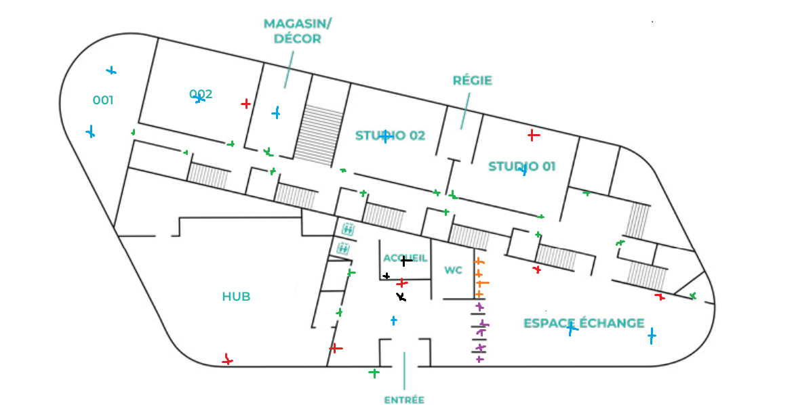
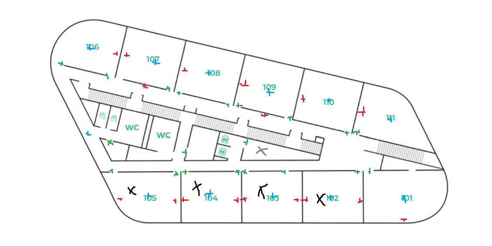
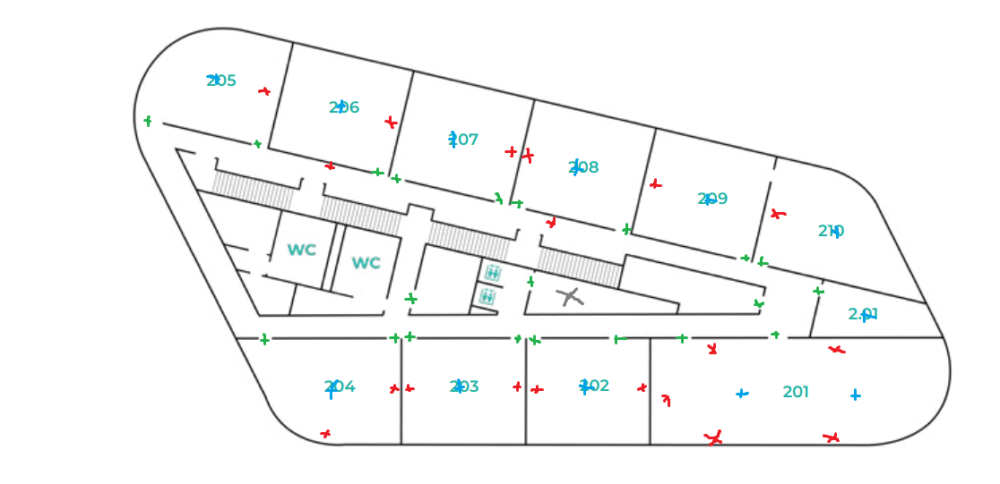
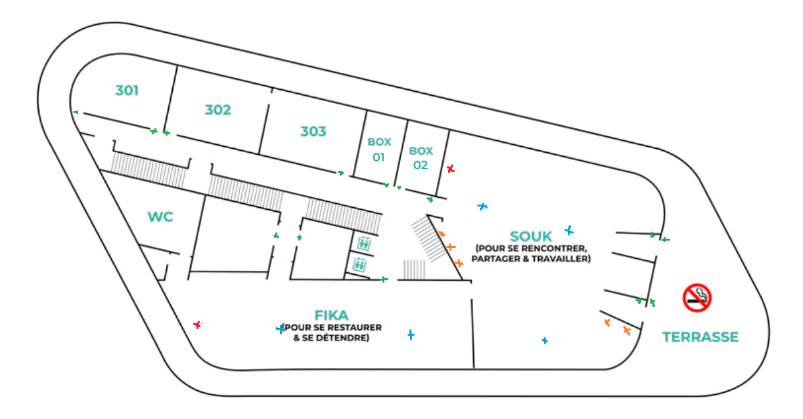

# Tp 3 Linux

## *I.Etat du Réseaux et Plan du site*

Le réseau d'Ynov est constitué d'au moins 3 sous-réseaux:
-le LAN WIFI où tout le monde est lorsqu'il se connecte au WIFI : WIFI@YNOV et qui est compris entre l'IP 10.33.64.1 et l'IP 10.33.79.254
-le LAN des télés qui est joignable depuis le LAN WIFI et qui est compris entre l'IP 10.33.80.1 et L'IP 10.33.81.254
-le LAN admins 

Nous pensons qu'il doit y avoir d'autre LAN pour chaque élément connecté au réseau d'YNOV, comme un LAN pour les caméras de sécurité et un LAN pour les portiques et les boîters de portes mais nous n'avons pas réussi à y accéder.

**Plan des étages**

### RDC
 
### 1er

### 2eme

### 3eme

**Legende :**
- Rouge : Télévision
- Bleu : Borne WIFI
- Orange : Distributeur / Machine à café
- Vert : Porte à Badge
- Violet : Portique
- Noir : PC / Imprimante / Salle avec PC
- Gris : Salle Serveur

PS: nous avons pas cartographié le 4ème étage pour ne pas déranger le staff

## II. Liste des Éléments et Vulnérabilité Possible

**Télévision**:

L'ip de chaque télé est static sur le LAN 10.33.81... 

Les télévisions disposent d'une fonction de partage d'écran et nous invitent à télécharger une application afin d'utiliser cette fonction. Pour l'installer plusieurs possibilités s'offre à lui, soit par le site officielle "eshare" qui est sécurisée, soit en tapant l'addresse ip d'une des télés puis en précisant le port 8000 dans la barre de recherche. Ce qui nous amène sur la même page que le site eshare mais cette fois-ci, nous ne sommes pas en https. Ce qui permet à n'importe qui de faire télécharger un exe à toutes les personnes qui essayent de télécharger par ce lien.

**Portique et Boitier porte**

Tous les portiques et le boitier de porte fonctionnent grâce à la technologie de NFC. Dû à manque de moyens, nous n'avons pas pu récupérer le signal émis par les cartes et les téléphones, mais savons que le code de chaque téléphone change régulièrement et pour les badges, nous pensons qu'il est composé d'un code chiffrer qui nous empéche de juste copier la carte pour la réutiliser. 

Pour chaque boitier de porte, ils sont relier aux réseaux grâce à des boîtiers installer au plafonds dans les couloirs (environ 1 toutes les 2 portes) avec leur adresse MAC indiquer dessus. Nous n'avons pas eu le temps de les trouver dans le réseau, mais si celles-ci sont joignables, il est s'en doute possible d'ouvrir toutes les portes en envoyant une trame présice à ce boîtier.

**Caméra de surveillance**

Les caméras de surveillance sont connectées sur le reseau, qui doit être distinct lui aussi, soit en connexion Wi-Fi, mais nous pensons plus quelles sont connectées en filaire.

**Prise RJ45**

Dans tous les couloirs et au souk (et un peu partout dans les salles et le bâtiment en général), des prises RJ45 sont apparentes dans les murs et même au plafond. Celles des couloirs ne nous donnes aucune connexion, ni IP. En revanche, celle du SOUK, nous donne accès au réseau des télés et nous donne une IP static.

**Switch**

Un switch est apparent au niveau des distributeurs du SOUK, celui-ci relie la machine à café et le distributeur au réseau (Nous nous sommes pas branché dessus pour éviter de tous peter, mais nous pensons qui se connecte soit au réseau admin, soit à un autre réseau juste pour les machines).

## III. Scan du Réseaux

Nous avons effectué deux scans dans le LAN 10.33.64.1/20. Le premier a été effectué le 9/11 en pleine après-midi, donc pendant les heures avec le plus de monde connecté aux réseaux, l'autre étant effectué le 10/11 au soir entre 17h15 et 19h30 pendants les heures creuses. 

C'est scan nous on permit de découvrir les machines qui sont connectées au réseau en permanence, et de voir les machines qui sont connectées de manière temporaire grâce au petit script que nous avons fait : [coucou.py](./Ressource/coucou.py).

Le résultat se trouve dans [result_filtered.txt](./Ressource/result_filtered.txt).

À terme, nous pouvons envisager de faire plus approfondi de ces machines pour pouvoir les identifier et les classer dans des catégories (serveur, imprimante, etc...).